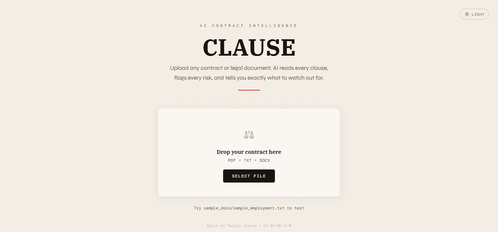
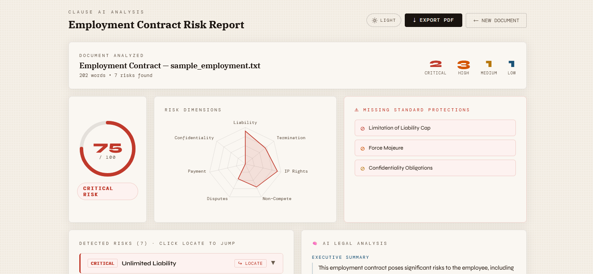
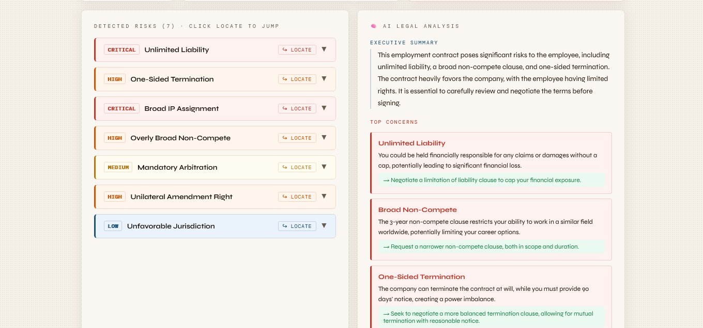
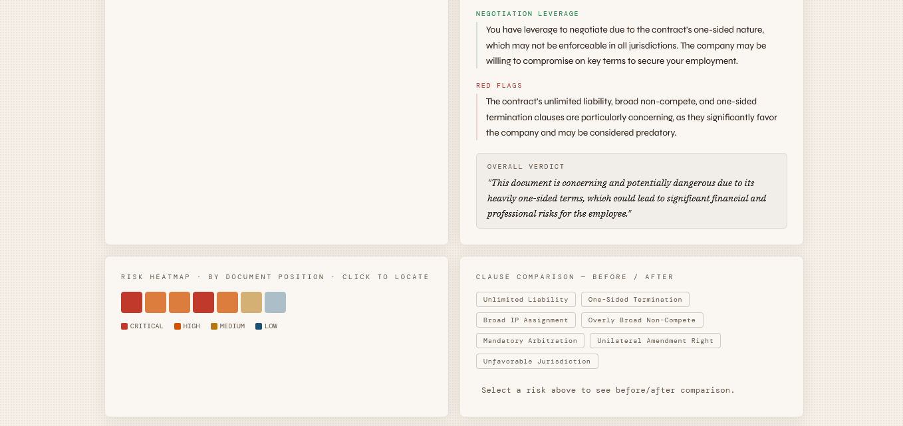
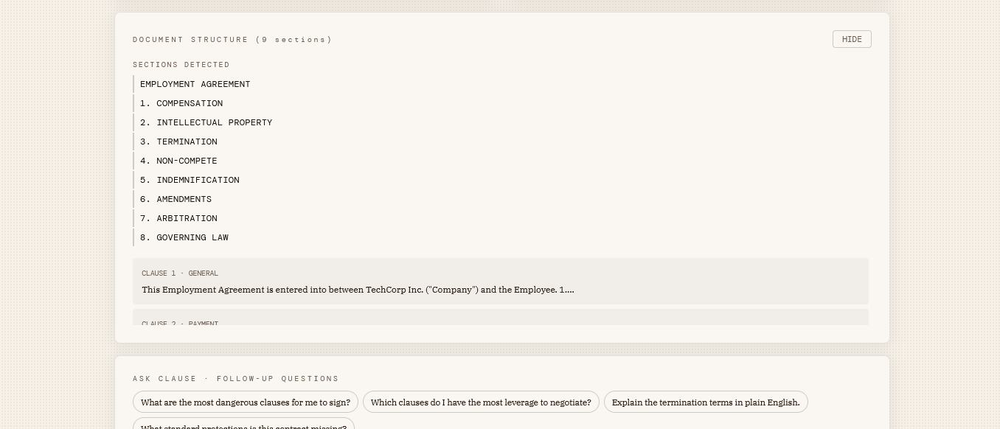
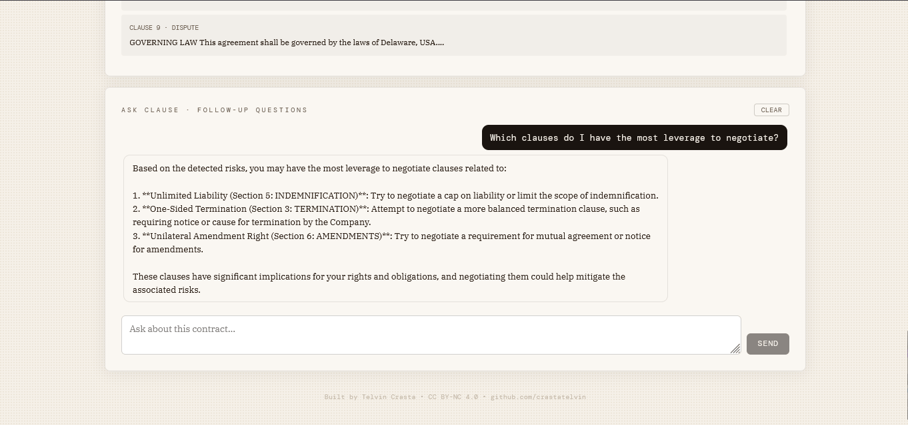
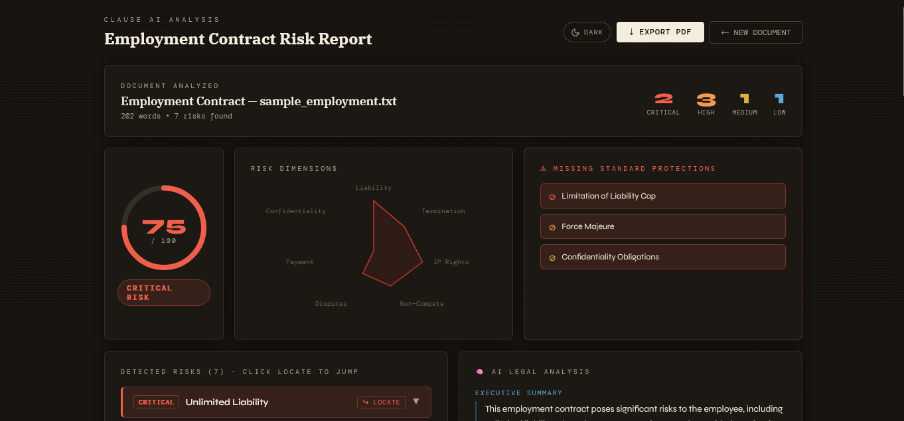
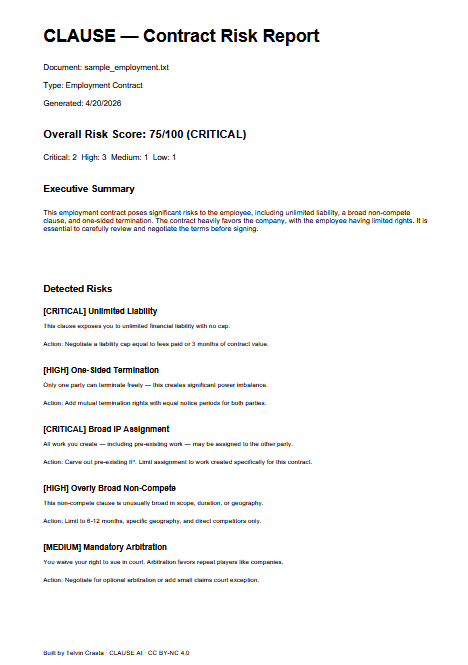

<div align="center">

# ⚖️ CLAUSE AI

### An AI Contract Risk Analyzer — Upload a Contract, Get a Lawyer-Grade Risk Report in Seconds

[](https://www.python.org/)
[](https://fastapi.tiangolo.com/)
[](https://react.dev/)
[](https://www.framer.com/motion/)
[](https://recharts.org/)
[](https://groq.com/)
[](LICENSE)

<br/>

> **CLAUSE** is a full-stack AI contract intelligence tool that reads any legal document — employment contracts, NDAs, freelance agreements, service contracts — and turns it into a structured risk report with **18 pattern-based rules**, **Groq-powered legal reasoning**, **position-aware highlights**, and a **streaming Q&A panel** you can use to interrogate the contract in plain English.

<br/>

   

</div>

---

## 📋 Table of Contents

- [Overview](#-overview)
- [Application Preview](#-application-preview)
- [Features](#-features)
- [Architecture](#-architecture)
- [Tech Stack](#-tech-stack)
- [Project Structure](#-project-structure)
- [Installation](#-installation)
- [Usage](#-usage)
- [The Analysis Pipeline](#-the-analysis-pipeline)
- [Risk Dimensions & Rules](#-risk-dimensions--rules)
- [API Reference](#-api-reference)
- [Configuration](#-configuration)
- [Theming](#-theming)
- [Testing](#-testing)
- [Security Notes](#-security-notes)
- [Contributing](#-contributing)
- [License](#-license)

---

## ⚖️ Overview

CLAUSE solves a small but painful problem: **most people sign contracts they don't understand**. Lawyers are expensive, legalese is dense, and the clauses that will actually hurt you are buried in the middle of a 20-page document. CLAUSE reads the whole thing, flags the traps, explains *why* they're traps in plain English, and tells you what to ask for instead.

Users can:

- **Drop any PDF / DOCX / TXT / MD** into the browser — documents up to 10 MB
- Watch a **live WebSocket progress stream** as the backend parses, extracts clauses, scans for risks, and asks Groq for deep legal reasoning
- See a **risk dashboard** — overall 0–100 score, 7-dimension radar, severity-coded heatmap by document position
- **Click any risk → jump to the exact clause in the document** and watch it flash-highlight
- Ask **follow-up questions** in a streaming chat panel that sees the full document context
- Export a **branded PDF report** with one click
- Toggle between a **light cream "paper" theme** and a **deep espresso dark theme**, persisted across tabs

The backend is **FastAPI** + **Groq** (`llama-3.3-70b-versatile`) with a dual-layer risk engine: an instant **regex pattern scanner** over 18 curated legal red flags, then a **structured Groq JSON call** that reasons about the top concerns, negotiation leverage, red flags, and overall verdict. The frontend is **React 18** with **Framer Motion** animations, **Recharts** for the dimension radar, and a custom CSS-variable theming system with no-flash light/dark switching.

---

## 🖼️ Application Preview

<div align="center">

### Landing / Upload


### Risk Dashboard (Score + Radar + Missing Protections)


### Detected Risks & AI Legal Analysis


### Risk Heatmap + Before/After Comparison


### Click-to-Locate Document Viewer


### Ask CLAUSE — Streaming Chat


### Dark Mode


### Exported PDF Report


</div>

---

## ✨ Features

| Feature | Description |
|---|---|
| 📄 **Multi-Format Parser** | PyMuPDF for PDF, `python-docx` for DOCX, plain text fallback for TXT / MD — large legal docs handled in milliseconds |
| 🔎 **18-Rule Regex Scanner** | Curated legal red flags across 7 dimensions — unlimited liability, one-sided termination, broad IP assignment, perpetual confidentiality, class action waivers, personal guarantees, and more |
| 🧠 **Groq Deep Analysis** | `llama-3.3-70b-versatile` with JSON response mode — structured output for executive summary, top concerns, negotiation leverage, red flags, overall verdict |
| 📍 **Position-Aware Risks** | Every detected risk carries character offsets + nearest section header. Click any risk → the document viewer scrolls to that clause and flashes it |
| 📊 **Risk Dashboard** | 0–100 overall score gauge, 7-dimension radar chart, severity-colored heatmap of risks by document position |
| ✉️ **Missing Clause Detection** | Flags absent *standard protections* (liability cap, termination notice, IP carve-outs, confidentiality, governing law, etc.) |
| 💬 **Streaming "Ask CLAUSE" Chat** | Token-by-token streaming follow-up questions using the same model, scoped to the analyzed document and its detected risks |
| 📡 **Per-Session WebSockets** | Progress events (`parsing` → `extracting` → `analyzing` → `ai` → `building` → `complete`) scoped by `request_id` so broadcasts never leak across users |
| 🛡️ **Rate Limiting** | `slowapi` guards `/analyze` (10/min) and `/chat` (30/min) with configurable env overrides |
| 💾 **Bounded LRU Cache** | Last N reports kept in-memory (default 50) keyed by `request_id`, exposed via `/reports`, `/latest`, `/report/{id}` |
| 🧩 **Before/After Clause Comparison** | Pick any detected risk → see the risky original excerpt next to the recommended fix |
| 📄 **Native PDF Export** | `jsPDF` text-based export — selectable, searchable, branded with author attribution |
| 🌓 **Light / Dark Mode** | Full CSS-variable palette, `prefers-color-scheme` fallback, no-flash init script, `localStorage` persistence, cross-tab sync |
| 🧱 **React Error Boundary** | UI crashes fall back to a friendly recovery screen instead of whitescreening |
| 🧪 **Fully Tested** | 15 Pytest tests covering parser, clause extractor, risk analyzer (including all 18 rules), and AI service stubs |
| ⚙️ **GitHub Actions CI** | Automated pytest + frontend build on every push / PR |

---

## 🏗️ Architecture

```
┌──────────────────────────────────────────────────────────────────────┐
│                      Browser / React 18 + CRA                        │
│                                                                      │
│  ┌────────────┐  ┌──────────────┐  ┌──────────────┐  ┌────────────┐  │
│  │ Document   │  │ Risk         │  │ Risk         │  │ Document   │  │
│  │ Upload     │  │ Dashboard    │  │ Heatmap +    │  │ Viewer +   │  │
│  │ (drag/drop │  │ (gauge +     │  │ Before/After │  │ Click-to-  │  │
│  │  + WS prog)│  │  radar +     │  │ Comparison   │  │ Highlight  │  │
│  │            │  │  missing)    │  │              │  │            │  │
│  └─────┬──────┘  └──────┬───────┘  └──────┬───────┘  └─────┬──────┘  │
│        │                │                 │                │         │
│  ┌─────▼────────────────▼─────────────────▼────────────────▼──────┐  │
│  │ Ask CLAUSE Chat Panel · streaming tokens over fetch+ReadableStream│
│  └─────────────────────────────────────────────────────────────────┘ │
│        │ POST /analyze      WS /ws?request_id=...      POST /chat    │
└────────┼──────────────────────────┼───────────────────────┼──────────┘
         │                          │                       │
┌────────▼──────────────────────────▼───────────────────────▼──────────┐
│                        FastAPI Backend (main.py)                     │
│                                                                      │
│  ┌────────────────────────────────────────────────────────────────┐  │
│  │                   Analysis Pipeline (sequential)               │  │
│  │                                                                │  │
│  │   PARSE  ──►  EXTRACT  ──►  SCAN  ──►  REASON  ──►  REPORT     │  │
│  │   (PDF /     (clauses +    (18 regex   (Groq JSON   (LRU cache │  │
│  │    DOCX /    sections +     rules +     executive    + /latest │  │
│  │    TXT)      offsets)       missing)    brief)       + /reports│  │
│  └────────────────────────────────────────────────────────────────┘  │
│                                                                      │
│  ┌────────────────────┐  ┌──────────────────┐  ┌──────────────────┐  │
│  │ document_parser.py │  │ risk_analyzer.py │  │  ai_service.py   │  │
│  │ • PyMuPDF (PDF)    │  │ • 18 rules       │  │ • Groq SDK       │  │
│  │ • python-docx      │  │ • 7 dimensions   │  │ • JSON mode      │  │
│  │ • plain text       │  │ • char offsets   │  │ • streaming chat │  │
│  │                    │  │ • missing clauses│  │ • stub fallback  │  │
│  └────────────────────┘  └──────────────────┘  └──────────────────┘  │
│                                                                      │
│  ┌────────────────────┐  ┌──────────────────┐  ┌──────────────────┐  │
│  │ clause_extractor.py│  │  ReportStore     │  │ConnectionManager │  │
│  │ • clause split +   │  │  (LRU cache +    │  │ (per-request_id  │  │
│  │   classify         │  │   /latest)       │  │  WS broadcast)   │  │
│  │ • section headers  │  │                  │  │                  │  │
│  └────────────────────┘  └──────────────────┘  └──────────────────┘  │
│                                                                      │
│  ┌────────────────────┐  ┌──────────────────┐  ┌──────────────────┐  │
│  │  slowapi Limiter   │  │ report_generator │  │  CORS middleware │  │
│  │  /analyze 10/min   │  │ • final JSON     │  │  env-driven      │  │
│  │  /chat    30/min   │  │   shape          │  │  ALLOWED_ORIGINS │  │
│  └────────────────────┘  └──────────────────┘  └──────────────────┘  │
└──────────────────────────────────────────────────────────────────────┘
                                  │
                                  ▼
                     ┌───────────────────────────┐
                     │       Groq Cloud API      │
                     │  llama-3.3-70b-versatile  │
                     └───────────────────────────┘
```

---

## 🛠️ Tech Stack

| Layer | Technology |
|---|---|
| **Frontend** | React 18, CRA, Framer Motion, Recharts, Axios, jsPDF, custom CSS-variable theming |
| **Backend** | FastAPI, Uvicorn, Pydantic, Python 3.10+, `slowapi` rate limiting, `python-dotenv` |
| **LLM Provider** | Groq Cloud — `llama-3.3-70b-versatile` with JSON response mode + streaming chat |
| **Document Parsing** | PyMuPDF (`fitz`) for PDF, `python-docx` for DOCX, native Python for TXT / MD |
| **Risk Engine** | Curated regex rule set (18 rules, 7 dimensions) with character offsets + section context |
| **Streaming** | Native FastAPI WebSockets (progress) + `StreamingResponse` over `fetch` + `ReadableStream` (chat) |
| **Testing** | Pytest (15 tests) covering parser, extractor, risk analyzer, AI service stubs |
| **CI** | GitHub Actions — pytest + frontend production build on every push / PR |
| **Export** | `jsPDF` native text export — selectable, searchable, branded |

---

## 📁 Project Structure

```
clause-ai/
│
├── backend/
│   ├── main.py                     # FastAPI app — /analyze, /chat, /ws, /latest, /reports, /report/:id
│   ├── ai_service.py               # Groq client — deep JSON analysis + streaming chat, stub fallback
│   ├── risk_analyzer.py            # 18-rule regex scanner, 7 dimensions, missing-clause detector
│   ├── clause_extractor.py         # Clause splitter, type classifier, section headers
│   ├── document_parser.py          # PyMuPDF / python-docx / text multi-format parser
│   ├── report_generator.py         # Final report shape + timezone-aware timestamp
│   ├── requirements.txt            # Python deps
│   ├── .env.example                # GROQ_API_KEY + rate limits + CORS + cache size
│   │
│   └── tests/
│       ├── conftest.py             # Adds backend dir to sys.path for pytest
│       ├── test_risk_analyzer.py   # Clause offsets, section extraction, all 18 rules
│       ├── test_document_parser.py # DOCX + fallback parsing
│       └── test_ai_service.py      # No-key stub + chat context builder
│
├── frontend/
│   ├── public/
│   │   └── index.html              # No-flash theme-init script
│   ├── src/
│   │   ├── App.jsx                 # Root — ErrorBoundary + upload ↔ analysis
│   │   ├── index.js                # React DOM entry
│   │   ├── pages/
│   │   │   └── AnalysisPage.jsx    # Full report layout + highlight wiring
│   │   ├── components/
│   │   │   ├── DocumentUpload.jsx  # Drag-and-drop upload + live WS progress
│   │   │   ├── RiskScoreGauge.jsx  # 0-100 conic gauge, level-colored
│   │   │   ├── RiskSummaryBar.jsx  # Critical / High / Medium / Low tallies
│   │   │   ├── DimensionRadar.jsx  # 7-dimension radar (Recharts)
│   │   │   ├── MissingClauseAlert.jsx # Standard protections missing
│   │   │   ├── ClauseAnnotation.jsx   # Expandable risk card w/ LOCATE button
│   │   │   ├── RecommendationPanel.jsx # Groq executive analysis
│   │   │   ├── RiskHeatmap.jsx     # Clickable severity heatmap by position
│   │   │   ├── ComparisonMode.jsx  # Before/After clause rewrite view
│   │   │   ├── DocumentViewer.jsx  # Scrollable clauses + flash-highlight
│   │   │   ├── ChatPanel.jsx       # Streaming "Ask CLAUSE" Q&A
│   │   │   ├── ExportReport.jsx    # Native jsPDF export
│   │   │   ├── ThemeToggle.jsx     # Light / Dark pill toggle
│   │   │   └── ErrorBoundary.jsx   # Friendly UI crash recovery
│   │   ├── hooks/
│   │   │   └── useTheme.js         # Theme state + persistence + cross-tab sync
│   │   ├── services/
│   │   │   └── api.js              # Axios wrappers + typed AnalyzeError
│   │   └── styles/
│   │       └── globals.css         # Full light + dark CSS-variable palette
│   └── package.json
│
├── sample_docs/
│   ├── sample_employment.txt       # Predatory employment contract for testing
│   └── sample_nda.txt              # Overbroad NDA for testing
│
├── .github/
│   └── workflows/
│       └── ci.yml                  # Pytest + frontend build on push/PR
│
├── DECISIONS.md                    # Architecture decisions + trade-offs
├── LICENSE                         # CC BY-NC 4.0
└── README.md
```

---

## 🚀 Installation

### Prerequisites
- **Python 3.10+**
- **Node.js 18+**
- A [Groq API key](https://console.groq.com/keys) *(free tier works great)* — optional, CLAUSE falls back to a deterministic stub if not set

### 1. Clone the Repository
```bash
git clone https://github.com/crastatelvin/clause-ai.git
cd clause-ai
```

### 2. Backend Setup
```bash
cd backend
python -m venv .venv

# Activate virtual environment
source .venv/bin/activate        # Linux / macOS
.venv\Scripts\Activate.ps1       # Windows PowerShell

pip install -r requirements.txt
```

### 3. Configure Environment Variables
Create a `.env` file inside `backend/` (copy from `.env.example`):

```bash
# Groq API key (optional — leave empty for deterministic stub fallback)
GROQ_API_KEY=your_groq_api_key_here

# Optional: override the default Groq model
# GROQ_MODEL=llama-3.3-70b-versatile

# Optional: comma-separated CORS allow-list (defaults to *)
# ALLOWED_ORIGINS=http://localhost:3000,https://clause.example.com

# Optional: upload / cache limits (shown with defaults)
# MAX_UPLOAD_MB=10
# MAX_CACHED_REPORTS=50

# Optional: rate limits (slowapi syntax, e.g. "10/minute")
# ANALYZE_RATE_LIMIT=10/minute
# CHAT_RATE_LIMIT=30/minute
```

### 4. Start the Backend
```bash
uvicorn main:app --reload --host 127.0.0.1 --port 8000
```
API runs at `http://localhost:8000` · Interactive docs at `http://localhost:8000/docs`

### 5. Frontend Setup
```bash
cd ../frontend
npm install
```

Optional — create a `.env` in `frontend/` to override the defaults:

```bash
REACT_APP_API_URL=http://localhost:8000
REACT_APP_WS_URL=ws://localhost:8000/ws
```

### 6. Start the Frontend
```bash
npm start
```
Frontend runs at `http://localhost:3000`

---

## 💻 Usage

### Analyzing a Contract
1. Open the app at `http://localhost:3000`
2. **Drag and drop** your contract — or click **SELECT FILE** (PDF, DOCX, TXT, MD, up to 10 MB)
3. Watch the progress stream as the pipeline runs — typically 3–10 seconds end-to-end
4. The analysis page opens with a full risk report

### Reading the Report
- **Risk Summary Bar** — filename, document type, word count, critical/high/medium/low tallies
- **Risk Score Gauge** — overall 0–100 score with color-coded level chip (CRITICAL / HIGH / MEDIUM / LOW)
- **Dimension Radar** — the 7 risk dimensions (Liability, Termination, IP Rights, Non-Compete, Disputes, Payment, Confidentiality) plotted as a radar
- **Missing Protections** — standard clauses the contract *lacks*, with importance icons
- **Detected Risks** — every risk, expandable: excerpt, section context, *why it matters*, *recommended action*
- **AI Legal Analysis** — Groq's executive summary, top concerns, negotiation leverage, red flags, overall verdict
- **Risk Heatmap** — severity-colored tiles ordered by document position — click to jump
- **Before / After Comparison** — pick any risk to see the risky original next to the recommended fix
- **Document Structure Viewer** — every clause with its classified type; flash-highlights when you click LOCATE on a risk
- **Ask CLAUSE** — streaming chat panel for follow-up questions over the full document

### Clicking Around
- **LOCATE** on any risk card (or any tile on the heatmap) → the document viewer scrolls to that clause and flashes it red for ~2 seconds
- **Export PDF** → a branded, searchable, text-based PDF report
- **Theme toggle** (top-right pill) → flips the entire UI between light cream and deep espresso, persisted across tabs

### Ask CLAUSE — Follow-up Questions
The chat panel sees the full document and all detected risks. Example questions:
- *"What are the most dangerous clauses for me to sign?"*
- *"Which clauses do I have the most leverage to negotiate?"*
- *"Explain the termination terms in plain English."*
- *"What standard protections is this contract missing?"*

Responses stream token-by-token in real time.

---

## 🤖 The Analysis Pipeline

| Stage | Module | What It Does |
|---|---|---|
| 🟡 **PARSE** | `document_parser.py` | PyMuPDF for PDFs, `python-docx` for DOCX, native read for TXT/MD. Produces clean text + word count |
| 🟠 **EXTRACT** | `clause_extractor.py` | Splits the document into clauses with character offsets + type classification (payment, termination, IP, confidentiality, dispute, …). Finds section headers |
| 🔴 **SCAN** | `risk_analyzer.py` | Runs 18 regex rules across 7 dimensions. Every match carries severity, dimension, excerpt, character offsets, nearest section, explanation, recommendation. Also detects missing *standard protections* |
| 🟣 **REASON** | `ai_service.py` | Sends a compact prompt (doc excerpt + top detected risks + missing clauses) to Groq `llama-3.3-70b-versatile` with JSON response mode. Returns executive summary, top concerns, negotiation leverage, red flags, overall verdict |
| 🔵 **REPORT** | `report_generator.py` + `ReportStore` | Assembles the final JSON report, stamps it with UTC timestamp + `request_id`, stores in the LRU cache, and streams `complete` over WebSocket |

All five stages emit WebSocket events over `/ws?request_id=...` so the UI can show a live progress bar.

---

## 🎯 Risk Dimensions & Rules

CLAUSE scans every document against **18 curated rules** bucketed into **7 legal dimensions**:

| Dimension | Rules |
|---|---|
| **Liability** | Unlimited Liability · Personal Guarantee · Liquidated Damages |
| **Termination** | One-Sided Termination · Automatic Renewal · Change of Control |
| **IP Rights** | Broad IP Assignment · One-Sided Anti-Assignment |
| **Non-Compete** | Overly Broad Non-Compete |
| **Disputes** | Mandatory Arbitration · Class Action Waiver · One-Way Attorney Fees · Unfavorable Governing Law |
| **Payment** | Payment Delay / Offset Rights |
| **Confidentiality** | Perpetual Confidentiality · Data Sharing · As-Is / No Warranty · Unilateral Amendment |

Each rule produces a finding with:

```json
{
  "id": "unlimited_liability",
  "name": "Unlimited Liability",
  "dimension": "liability",
  "severity": "critical",
  "position": { "start": 4213, "end": 4287 },
  "section": "6. INDEMNIFICATION",
  "excerpt": "...shall be liable for any and all losses...",
  "explanation": "This clause exposes you to unlimited financial liability with no cap.",
  "recommendation": "Negotiate a liability cap equal to fees paid or 3 months of contract value."
}
```

The severity counts are fed into a 0–100 weighted overall score, and the dimension totals drive the radar chart.

---

## 🔌 API Reference

| Method | Endpoint | Description |
|---|---|---|
| `GET` | `/` | Health + metadata (model provider, feature list, version) |
| `POST` | `/analyze` | Upload a document for analysis. Multipart form: `file`. Optional query: `request_id`. Rate-limited 10/min |
| `POST` | `/chat` | Streaming follow-up Q&A. Body: `{ request_id, message, history[] }`. Rate-limited 30/min |
| `GET` | `/latest` | Most recent analysis |
| `GET` | `/report/{request_id}` | Fetch a specific cached report |
| `GET` | `/reports` | List all cached reports (metadata only) |
| `GET` | `/status` | Cache size + latest ID |
| `WS` | `/ws?request_id=...` | Per-session progress stream: `parsing` → `extracting` → `analyzing` → `ai` → `building` → `complete` |

**Example — analyze a contract:**
```bash
curl -X POST "http://localhost:8000/analyze?request_id=mytest" \
  -F "file=@sample_docs/sample_employment.txt"
```

**Example — streaming chat:**
```bash
curl -N -X POST http://localhost:8000/chat \
  -H "Content-Type: application/json" \
  -d '{
    "request_id": "mytest",
    "message": "What are the worst clauses in this contract?",
    "history": []
  }'
```

**Example WebSocket progress event:**
```json
{
  "step": "ai",
  "message": "Running deep AI analysis via Groq..."
}
```

---

## ⚙️ Configuration

### Backend (`backend/.env`)
```bash
GROQ_API_KEY=...                            # optional — falls back to deterministic stub
GROQ_MODEL=llama-3.3-70b-versatile          # override Groq model
ALLOWED_ORIGINS=*                           # comma-separated, restrict in production
MAX_UPLOAD_MB=10                            # per-file upload cap
MAX_CACHED_REPORTS=50                       # LRU cache size
ANALYZE_RATE_LIMIT=10/minute                # slowapi syntax
CHAT_RATE_LIMIT=30/minute
LOG_LEVEL=INFO
```

### Frontend (`frontend/.env`)
```bash
REACT_APP_API_URL=http://localhost:8000
REACT_APP_WS_URL=ws://localhost:8000/ws
```

---

## 🌓 Theming

CLAUSE ships a full **light / dark CSS-variable theming system** with no runtime overhead:

| Layer | Behavior |
|---|---|
| **No-flash init** | Inline script in `public/index.html` reads `localStorage('clause-theme')` → falls back to `prefers-color-scheme` → sets `<html data-theme="...">` *before* React paints |
| **Palette** | ~40 variables in `globals.css` — surfaces, inks, severity colors (red/orange/amber/blue/green), borders, shadows, chat bubble tones, dot-pattern fill |
| **`useTheme` hook** | Reads / writes current theme, persists to `localStorage`, syncs across browser tabs via `storage` events |
| **`ThemeToggle`** | Animated pill (sun ↔ moon) in the top-right of both upload and analysis pages |
| **Smooth transitions** | 300 ms ease on `background-color` + `color` across `body`, cards, and the dot-pattern background |

Severity colors are tuned for both modes — 12% alpha backgrounds + 35% alpha borders in dark, solid tints in light.

---

## 🧪 Testing

```bash
# Backend — Pytest
cd backend
pytest

# Frontend — production build (doubles as a compile / lint check)
cd ../frontend
npm run build
```

The Pytest suite (15 tests) covers:

- **Parser** — DOCX parsing, unknown-extension fallback to text
- **Clause extractor** — clause splitting with character offsets, section header extraction
- **Risk analyzer** — detection on known-risky documents, clean-document false-positive check, and **every one of the 18 rules firing individually**
- **AI service** — stub behavior with no API key, response normalization, chat context builder + history truncation

GitHub Actions runs the same suite + frontend build on every push and pull request.

---

## 🔒 Security Notes

> CLAUSE is built for **local development and portfolio demos**. Before any public deployment:

- The backend defaults `ALLOWED_ORIGINS=*` — restrict this to your actual frontend domain
- `ReportStore` is an in-memory LRU — reports don't survive restarts and aren't safe for multi-tenant production; swap in Redis / Postgres if needed
- `_document_text` (the full raw document) is stored server-side so `/chat` can reason over it — strip it before logging and consider encryption at rest
- Never commit your `.env` or expose `GROQ_API_KEY` publicly — `.gitignore` is hardened but always double-check
- `slowapi` rate limits are keyed by **remote IP** — put CLAUSE behind a reverse proxy that preserves `X-Forwarded-For` if you want real per-user limits
- Upload cap defaults to **10 MB** and the parser validates extensions before parsing — adjust `MAX_UPLOAD_MB` with care
- The Groq prompts truncate the document to 6k chars to keep cost bounded — if you raise this, watch your token usage

---

## 🤝 Contributing

1. Fork the repository
2. Create a feature branch: `git checkout -b feature/your-feature`
3. Commit your changes: `git commit -m 'Add your feature'`
4. Push: `git push origin feature/your-feature`
5. Open a Pull Request

**Ideas for improvement:** persistent report storage (Postgres / Redis), user accounts + per-user history, diff mode (compare v1 vs v2 of the same contract), batch analysis, OCR for scanned PDFs, more risk rules (force majeure, most-favored-nation, audit rights), alternative LLM providers (Cerebras, Together, Gemini, Anthropic), export to DOCX / Markdown / Notion, embed-based clause similarity search, jurisdiction-aware risk weighting, multi-language contracts, Docker compose for one-command setup.

---

## 📜 License

Licensed under the **Creative Commons Attribution-NonCommercial 4.0 International** license — see [LICENSE](LICENSE) for full text.

- ✅ Free to use, share, and adapt for **learning, portfolios, and non-commercial projects**
- ✅ Must credit **Telvin Crasta** in derivatives
- ❌ No commercial use without explicit permission

Full license text: [creativecommons.org/licenses/by-nc/4.0](https://creativecommons.org/licenses/by-nc/4.0/)

---

<div align="center">

Built with ⚖️ by **[Telvin Crasta](https://github.com/crastatelvin)** — for anyone who's ever signed something they shouldn't have.

⭐ Star this repo if CLAUSE ever saves you from a bad clause.

</div>

## License

This project is licensed under the MIT License. See [LICENSE](./LICENSE).
